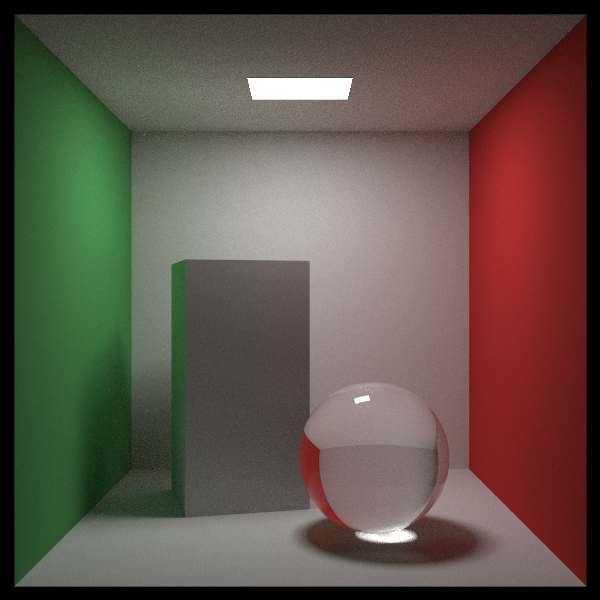
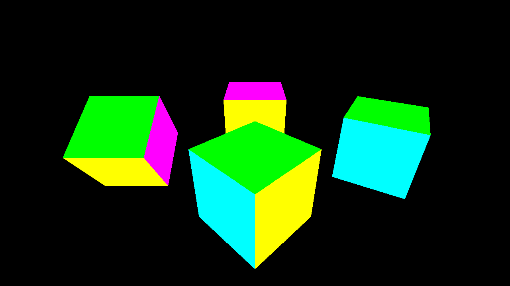

# in one weekend

Go implementation of the "in one weekend" series: [Ray Tracing in One Weekend](https://raytracing.github.io/) & [Rasterization in One Weekend](https://tayfunkayhan.wordpress.com/2018/11/24/rasterization-in-one-weekend-part-i/)

Part III of Rasterization in One Weekend remains unwritten. I plan to enhance the OBJ loader from tinyrenderer for this section.

